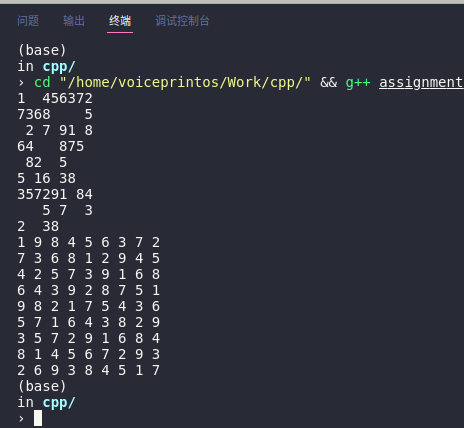

# document

# ideas

解决本题主要采用了**回溯**（backtracking）算法，其主要思想在于，每次只构造解的一个分量，然后评估这个部分构造解，如果它没有违反问题的约束，就接受这一合法选择，并继续构造解；如果无法构造合法解，就不必再考虑接下来的选择。如此往复，直到寻找到合法的解。

本代码的核心也在于`backTracking`函数。传入的参数分别为棋盘信息`board`（带引用以修改原数组，并减少内存消耗）和未填充的数字数量`count`。当`count`为0时，表示数独已经完成，达到临界条件，退出函数；当count＞0时，则从棋盘的左上方开始，按行遍历，找到第一个还没有填充的位置，找出其所有可能的数字，并依次填入，再次调用`backTracking`函数，并将其count参数减去1，表示需要填补的数字减少。如果遍历所有可行数字，都没有找到合适条件，则不必再往下计算，直接剪枝。记得在剪枝时将原先的空位重设成空位。

```c++
// backtracking
bool backTracking(vector<vector<char>>& board, const int count){
    // end condition
    if (count == 0)
        return true;
    
    // find the first position to fill
    int i, j;
    bool flag = false;
    for (i = 0;i < kSudokuSize;i++){
        for (j = 0;j < kSudokuSize;j++)
            if (board[i][j] == BLANK){
                flag = true;
                break;        
            }
        if (flag)
            break;
    }


    bool possibleNums[kSudokuSize + 1];
    // find all possible numbers
    findAllPossibleNums(board,i,j,possibleNums);

    for (int m = 1;m <= kSudokuSize;m++){
        if (possibleNums[m] == false)
            continue;

        board[i][j] = '0' + m;

        if (backTracking(board, count - 1))
            return true;
    }

    // fail to find a result
    // reset
    board[i][j] = BLANK;
    return false;
}
```


# algorithm complexity

假设有n个空位，对于每个空位，有 9 个可能的数字。因此，在最坏的情况下，时间复杂度为 O(9^n)。

# how to run

以Linux系统环境下，用g++编译为例：

```bash
# in the directory where the cpp locates
g++ assignment_2.cpp -o assignment_2
./assignment_2
```

即可运行


# successful screenshots



- 运行环境：Ubuntu 20.04
- IDE：VS Code
- 编译器：g++ （gcc version 9.4.0 (Ubuntu 9.4.0-1ubuntu1~20.04.1) ）