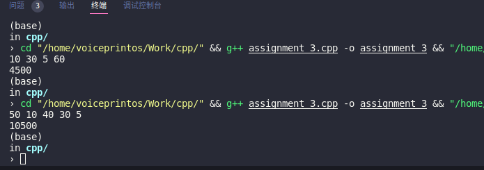

# document

# ideas

本题采用动态规划的思想解决问题。一个关键是找出递推关系式，另一个关键是减少重复计算。

- 对于第一个关键，本代码采用如下思想：

  设矩阵M..N

  - 若矩阵MN相邻，则最少运算次数等于`M.row*M.col*N.row`
  - 若MN之间不相邻，设K为M,N之间的任意一个矩阵，但不是N。则M到N的最少运算次数为所有`M.row*K.col*N.row`中的最小值

- 对于第二个关键，本代码用一个`P.size()-1`*`P.size()-1`的二维矩阵，表示第i个矩阵到第j个矩阵的最少操作数。初始设为-1。若i==j，则赋值0，否则按上述思想计算最少操作数

```c++
// 表示寻找P中第i个矩阵到第j个矩阵（均为闭区间）的最少操作数
// i起始为0
// 此外，因为长度为n的P仅表示n-1个矩阵
// 因此合理的参数应当为(0,P.size() - 2)
// dp用于存储数据 减少重复操作
// dp中UNDEFINE（-1）表示尚未被赋值
int matrixChainMultiplication(vector<int> &P, int i, int j, vector<vector<int>> &dp)
{
    // 如果已经计算好，则直接返回
    if (dp[i][j] != UNDEFINE)
        return dp[i][j];

    // 如果i==j，则赋0
    if (j == i)
    {
        dp[i][j] = 0;
        return dp[i][j];
    }

    dp[i][j] = INT_MAX;
    for (int m = i; m < j; m++)
    {
        // 对于矩阵i..j
        // 令k=[i..j)
        // dp[i][j]即为矩阵i..k的最少运算次数+矩阵k+1..j的最少运算次数+P[i]*P[k+1]*P[j+1]
        // 所有可能中的最小值
        dp[i][j] = std::min(dp[i][j], matrixChainMultiplication(P, i, m, dp) + matrixChainMultiplication(P, m + 1, j, dp) + P[i] * P[m + 1] * P[j + 1]);
    }
    return dp[i][j];
}
```


# algorithm complexity

时间复杂度为O(n^3)

空间复杂度为O(n^2)


# how to run

以Linux系统环境下，用g++编译为例：

```bash
# in the directory where the cpp locates
g++ assignment_3.cpp -o assignment_3
./assignment_3
```

即可运行


# successful screenshots



- 运行环境：Ubuntu 20.04
- IDE：VS Code
- 编译器：g++ （gcc version 9.4.0 (Ubuntu 9.4.0-1ubuntu1~20.04.1) ）